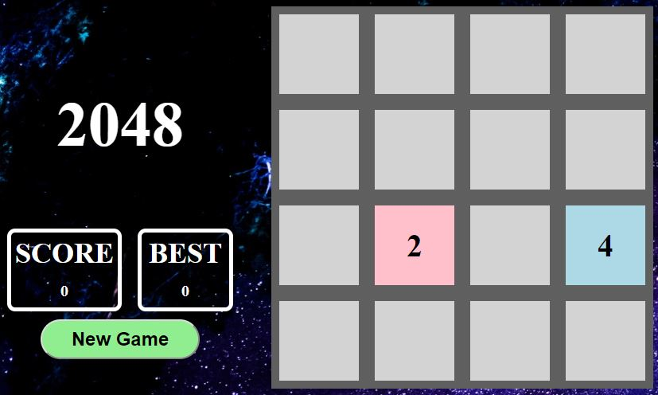

# 2048

## The Project Name:
### 2048

## Project Description:
Clone of teh populare 2048 game in which the player must push the direction of the board to 'push' the items together. In doing so, if there are like numbers, they will be combined into one square. The combined square will have the total of the 2 items

Push a '2' and a '2' together and a new square will be formed with a '4'
Push a '4' and a '4' together and a new square will be formed with a '8'

The object is to continue to combine them until the player gets a square with 2048

## Requirements:
Internet Browser (Chrome, Firefox, Safari, Etc...)

## Author:
Sean Waszkiewicz

## Technologies Used:
Javascript

Installation Instructions:
No additional resources needed

## Unsolved Problems:
No Issues

## Deployment:
https://pages.git.generalassemb.ly/seanwas/2048/
